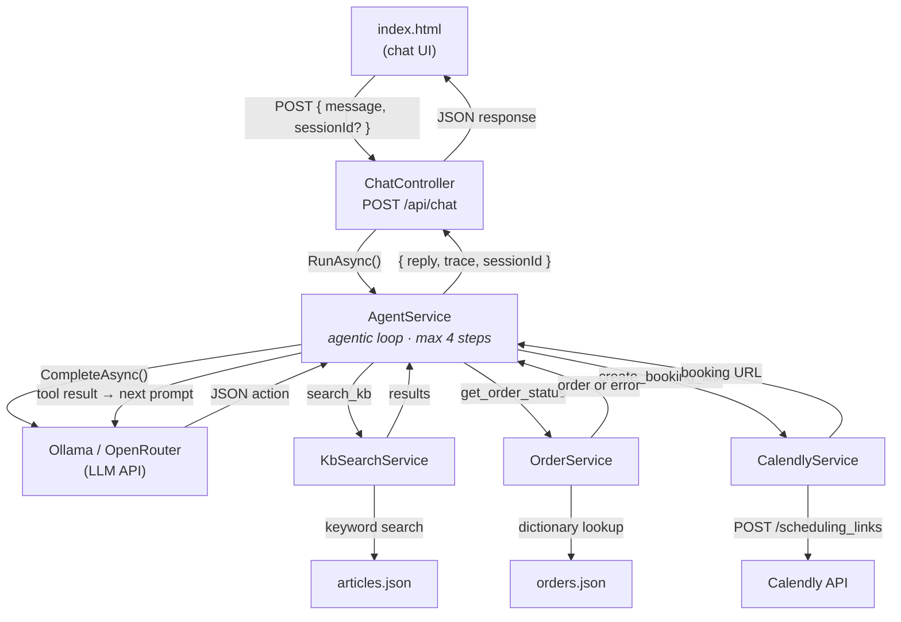

# Aster Support Agent

An AI-powered customer support chatbot for **Aster**, an online clothing store. Built as a .NET 10 minimal API with a single-page frontend, it demonstrates an **agentic tool-calling loop** — the LLM decides when to search the knowledge base, look up an order, or create a Calendly booking link, then responds to the customer with the gathered information.

## Architecture



The agent loop works as follows:

1. The user message (plus conversation history) is sent to the LLM with a system prompt.
2. The LLM responds with a single JSON action object (e.g. `{"action": "search_kb", "query": "..."}`).
3. `AgentService` parses the JSON, executes the matching local service, and feeds the result back as a new user message.
4. Steps 2–3 repeat until the LLM emits a `"respond"` action or the step limit (4) is reached.
5. The final reply and a full trace of every tool call are returned to the frontend.

## Project Structure

```
├── Controllers/
│   └── ChatController.cs       # POST /api/chat endpoint
├── Data/
│   ├── articles.json            # Knowledge base (~20 help articles)
│   └── orders.json              # Sample order data (ORD-1001 → ORD-1005)
├── DTOs/
│   ├── ChatRequest.cs           # { message, sessionId? }
│   ├── ChatResponse.cs          # { reply, trace, sessionId }
│   └── TraceStep.cs             # Per-step agent trace (tool_call / respond / fallback_raw)
├── Models/
│   ├── AgentAction.cs           # LLM action JSON shape + AgentActionType enum
│   ├── ChatModels.cs            # ChatMessage + ChatMessageRole
│   ├── KbArticle.cs             # Knowledge base article
│   ├── Order.cs                 # Order with full shipping/tracking fields
│   ├── OrderItem.cs             # Line item
│   └── JsonOptions.cs           # Shared, cached JsonSerializerOptions
├── Services/
│   ├── AgentService.cs          # Agentic loop orchestrator
│   ├── CalendlyService.cs       # Creates single-use Calendly scheduling links
│   ├── KbSearchService.cs       # Keyword-overlap scoring over articles.json
│   ├── OllamaClient.cs          # LLM client (Ollama / OpenAI-compatible)
│   ├── OpenRouterClient.cs      # Alternative LLM client (OpenRouter)
│   ├── OrderService.cs          # Order lookup by ID from orders.json
│   └── SessionStore.cs          # In-memory conversation history (capped at 20 messages)
├── wwwroot/
│   └── index.html               # Single-page chat UI (vanilla HTML/CSS/JS)
├── Program.cs                   # App setup, DI, middleware pipeline
├── appsettings.json             # Configuration (API keys, model, endpoints)
├── appsettings.Development.example.json
└── AsterSupportAgent.csproj     # .NET 10, no external NuGet deps beyond OpenAPI
```

## Prerequisites

- [.NET 10 SDK](https://dotnet.microsoft.com/download/dotnet/10.0)
- An LLM API key — either **Ollama** (OpenAI-compatible) or **OpenRouter**

## Getting Started

### 1. Clone and configure

```bash
git clone https://github.com/Md-Hasib-Askari/AsterSupportAgent
cd AsterSupportAgent
```

Copy the example config and fill in your API keys:

```bash
cp appsettings.Development.example.json appsettings.Development.json
```

Edit `appsettings.Development.json` (or `appsettings.json`) with real values:

```json
{
  "Ollama": {
    "ApiKey": "your-ollama-api-key",
    "Model": "gemma4:31b-cloud",
    "BaseUrl": "https://ollama.com/api"
  },
  "Calendly": {
    "ApiKey": "your-calendly-personal-access-token",
    "EventTypeUri": "https://api.calendly.com/event_types/your-event-type-uuid"
  }
}
```

> **Note:** Calendly integration is optional — the agent will return a graceful error message if the keys are missing. The LLM backend is required.

### 2. Run

```bash
dotnet run
```

The app starts at `http://localhost:5000` (or `https://localhost:7044`). Open it in a browser to use the chat UI, or hit the API directly:

```bash
curl -X POST http://localhost:5000/api/chat \
  -H "Content-Type: application/json" \
  -d '{"message": "What is the return policy?"}'
```

### 3. Response format

```json
{
  "reply": "You can return items within 30 days of delivery...",
  "trace": [
    {
      "step": 1,
      "type": "tool_call",
      "raw": "[Returns & Refunds] We accept returns within 30 days..."
    },
    {
      "step": 2,
      "type": "respond",
      "raw": "You can return items within 30 days of delivery..."
    }
  ],
  "sessionId": "sess-abc123"
}
```

Pass `sessionId` in subsequent requests to maintain conversation context.

## Tools

| Tool | Trigger | Data Source |
|------|---------|-------------|
| **KB Search** | Questions about shipping, returns, sizing, payments, etc. | `Data/articles.json` (keyword-overlap scoring) |
| **Order Lookup** | Customer provides an order ID (e.g. `ORD-1001`) | `Data/orders.json` (dictionary lookup) |
| **Calendly Booking** | Customer asks to talk to a human | Calendly Scheduling Links API |

## Switching LLM Backends

The project includes two LLM clients. To switch from Ollama to OpenRouter, update `Program.cs`:

```diff
- builder.Services.AddHttpClient<ILLMClient, OllamaClient>(client =>
+ builder.Services.AddHttpClient<ILLMClient, OpenRouterClient>(client =>
  {
-     client.BaseAddress = new Uri("https://ollama.com/api/chat");
-     client.DefaultRequestHeaders.Add("Authorization",
-         $"Bearer {builder.Configuration["Ollama:ApiKey"]}");
+     client.BaseAddress = new Uri($"{builder.Configuration["OpenRouter:BaseUrl"]}/chat/completions");
+     client.DefaultRequestHeaders.Add("Authorization",
+         $"Bearer {builder.Configuration["OpenRouter:ApiKey"]}");
  });
```

## Logging

Console logging is configured by default:

```
builder.Logging.ClearProviders().AddConsole();
```

Log levels are set in `appsettings.json`. The `OllamaClient` logs request details, response status, timing, and errors at `Information` / `Error` levels. Set `"Microsoft.AspNetCore": "Information"` to see HttpClient pipeline logs.

## Known Limitations

- **Session store** is in-memory — conversations are lost on restart and won't scale past a single instance. Swap for Redis or a distributed cache in production.
- **KB search** uses naive keyword overlap. An embedding-based vector search would generalize better to paraphrased queries.
- **No authentication** — the API is open. Add auth middleware for any real deployment.
- **Hardcoded data** — articles and orders are static JSON files. A database would be needed for a real store.

## Tech Stack

- **Runtime:** .NET 10 (ASP.NET Core minimal API)
- **Frontend:** Vanilla HTML, CSS, JavaScript (no framework)
- **LLM:** Ollama (OpenAI-compatible) or OpenRouter
- **Integrations:** Calendly Scheduling Links API
- **External dependencies:** None beyond `Microsoft.AspNetCore.OpenApi`

## License

See [LICENSE](LICENSE).
